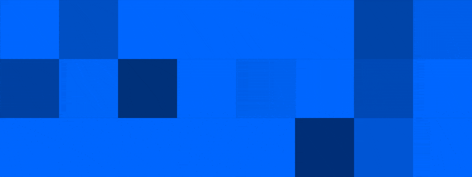
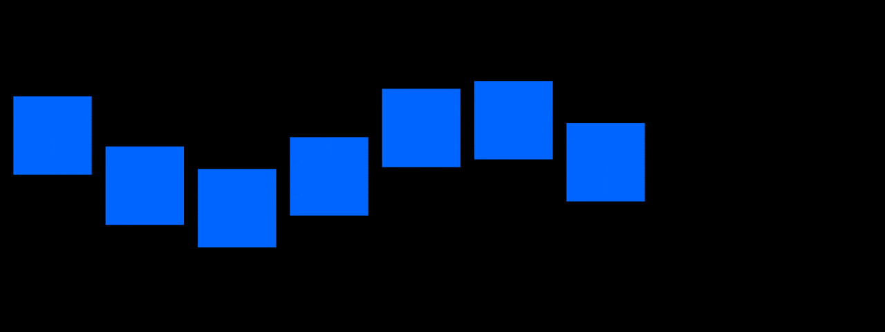

# Expressions & Snippets

## Transformation

### Constant value change using Time (drifting)

```javascript
time*50;

// for adding to an alement in an array such as position:
value + [time*50,0]

// for value change to start at inPoint
(time-inPoint)*50

// Throw (move at a constant speed without keyframes)
veloc = -10; //horizontal velocity (pixels per second)
x = position[0] + (time - inPoint) *veloc;
y = position[1];
[x,y]
 
```

### Align to X-axis or Y-axis



```javascript
var dst = 50;
var x= thisComp.layer(index-1).transform.position[0]+dst
;
value + [x,0]
;
```



```javascript
var xy = 0;
var dst = 50;
var x= thisComp.layer(index-1).transform.position[0]+dst
;
var x= thisComp.layer(index-1).transform.position[0]+dst
xy==0? value+[x,0]: value+[0,y]; // Ternary conditional operator
```



### Changing anchor point

```javascript
var s = sourceRectAtTime();

// Top left ↖
[s.left, s.top] // 

// Top center ↑
[s.left, s.top] + [s.width / 2, 0];

// Top right ↗
[s.left, s.top] + [s.width, 0];

// Center left ← 
[s.left, s.top] + [0, s.height / 2];

// Center
[s.left, s.top] + [s.width, s.height] / 2;

// Center right → 
[s.left, s.top] + [s.width, s.height / 2]

// Bottom left ↙

[s.left, s.top] + [0, s.height]

// Bottom center ↓ 
[s.left, s.top] + [s.width / 2, s.height]

//Bottom right ↘
[s.left, s.top] + [s.width, s.height]
```

### Random positioning XYZ


```javascript
seed = 20;
min = [25,25,-1900]; // Connect to 3D Point Control for control
max = [thisComp.width,thisComp.height,50]

seedRandom(seed,true);

random(min,max);

// This is same as this

// x= random(min[0],max[0]);
// y= random(min[1],max[1]);
// z= random(min[2],max[2]);

//[x,y,z]
```

## Scale

### Maintain Scale When Parented&#x20;



```javascript
s = [];
ps = parent.transform.scale.value;
for (i = 0; i < ps.length; i++){
s[i] = value[i]*100/ps[i];
}
s
```



```javascript
arr = value;
ps = parent.transform.scale.value;
ratio = 100/ ps[0];

arr*ratio;
```



## Rotation

### [Aim constraint](https://creativecow.net/forums/thread/aim-constraint/) by Kevin Camp / Dan Ebberts



```javascript
target = thisComp.layer("Null 1"); // set this to the layer to aim at
p = position - target.position;
radiansToDegrees( Math.atan2( p[1], p[0] ) )- 90
```



```javascript
target = thisComp.layer("controls"); // set this to the layer to aim at
p = thisLayer.toWorld(anchorPoint) - target.position;
radiansToDegrees(Math.atan2(p[1], p[0])) - 90
```



```
target = thisComp.layer("Null 1");// set this to the layer to aim at
lookAt( position, target.position )
```



### [Retrieving auto-orientation rotation value](https://forums.creativecow.net/docs/forums/post.php?forumid=227\&postid=15409\&univpostid=15409\&pview=t)

```javascript
L = thisComp.layer("Null 1");
v = L.toWorldVec([1,0]);
radiansToDegrees(Math.atan2(v[1],v[0]))
```

### Auto-orient along path by [Videolancer](https://videolancer.net/expressions/)

```javascript
try{
cornerEase = 3;
p = transform.position;
t = Math.min(Math.max(time,p.key(1).time+.001),p.key(p.numKeys).time);
pre = position.valueAtTime(t-thisComp.frameDuration*cornerEase);
post = position.valueAtTime(t+thisComp.frameDuration*cornerEase);
delta = post-pre;
orient = radiansToDegrees(Math.atan2(delta[0],-delta[1]));
value+orient+180
}catch(err){value}
```

## Parent

### Avoid inhering rotation

```javascript
value – parent.transform.rotation
```

## Opacity ✅

### Flickering / Strobe


```javascript
// VARIABLES
    minSeg = 1.5; //minimum interval (must be > 0) 
    maxSeg = 2.5; //maximum interval (must be > minSeg) 
    
    // flickering duration
    minFlicker = .5; //must be less than minSeg 
    maxFlicker = 1; // must be less than minSeg 
    flickerDur = random(minFlicker,maxFlicker);
    
    //initial conditions
    segEndTime = 0; 
    i = 1; 

// Continuous loop: create a fixed random segment value and add to segEndTime
while (time >= segEndTime){ 
    i += 1; 
    seedRandom(i,true); 
    segEndTime = segEndTime + random(minSeg,maxSeg); 
} 

// Switch back to use the current time as input to the random seed.
seedRandom(1,false); 

// As time > threshold, flicker
if (time > segEndTime - flickerDur){random(0,100) }else{ 100 }

// Source: http://www.motionscript.com/expressions-lab-ae65/swinging-light.html
// Also see: http://www.motionscript.com/mastering-expressions/random-3.html
```

### Random opacity wiggle&#x20;



```javascript
// control = thisComp.layer("control"); // connect to null layer with sliders
freq = 1;
amp = 100;
octave = 1;
amp_mult = 3;

wiggle(freq, amp, octave, amp_mult, time)
```

### Random opacity wiggle with flicker&#x20;


```javascript
// control = thisComp.layer("control"); // connect to null layer with sliders
freq = 1;
amp = 100;
octave = 1;
amp_mult = 3;

opacity = wiggle(freq, amp, octave, amp_mult, time)


// VARIABLES
minSeg = control.effect("minSeg")("Slider"); //minimum interval (must be > 0) 
maxSeg = control.effect("maxSeg")("Slider");; //maximum interval (must be > minSeg) 

// flickering duration
minFlicker = control.effect("minFlicker")("Slider");; //must be less than minSeg 
maxFlicker = control.effect("maxFlicker")("Slider");; // must be less than minSeg 
flickerDur = random(minFlicker, maxFlicker);

//initial conditions 
segStartTime = 0;
segEndTime = 0;
i = 1;

// Continuous loop: create a fixed random segment value and add to segEndTime
while (time >= segEndTime) {
    i += 1;
    seedRandom(i, true);
    segStartTime = segEndTime;
    segEndTime = segEndTime + random(minSeg, maxSeg);
}

// Switch back to use the current time as input to the random seed.
seedRandom(1, false);

// As time moves threshold, flicker
if (time > segEndTime - flickerDur) {
    random(0, 100)
} else {
    opacity
}
```

### Random opacity with sin function


```javascript
// Mass flickering
vel = 50;
seedRandom(0,true);
Math.sin(time*vel+random(index))*100;
```

.gif>)

```javascript
// 'Wave flickering'
vel = 50;
seedRandom(0,true);
Math.sin(time*vel+index)*100;

// Combining 
bool = 1
;
vel = 50;
seedRandom(0,true);
wave=Math.sin(time*vel+index)*100;
rand =Math.sin(time*vel+random(index))*100;


bool==0 ? wave : rand;
```

### Random opacity turn on


```javascript
seed = 29;
threshold = linear(time,0,thisComp.duration,0,100); // or Connect to slider to animate switch on & off

seedRandom(seed,true);
randValue = random(0,90);

if(randValue < threshold){
    100;} else 0
```

### Random opacity fade on&#x20;




```javascript
seed = 29;
seedRandom(seed,true);
delay = random(0,1);
t = framesToTime(20) // or usethisComp.duration

linear(time, 0+delay,t+delay,0,100)
```



```javascript
//VARIABLES
fadeDuration = 1;

maxDelay = .5

//SETUP

seedRandom(index,true);

delay = random(maxDelay);

t = time -(inPoint + delay);

// EXECUTION
linear(t,0,fadeDuration,0,100);
```



### Distance-based opacity fade by Animoplex

```javascript
// Distance Based Opacity Fade
// Original: https://helpx.adobe.com/after-effects/using/expression-examples.html
// Full Tutorial: https://www.youtube.com/watch?v=I-Acdl_l9G0&t=14s

startFade = 500;
endFade = 3000;
try {
    C = thisComp.activeCamera.toWorld([0,0,0]);
} catch(err) {
    w = thisComp.width * thisComp.pixelAspect;
    z = (w / 2)/Math.tan(degreesToRadians(19.799));
    C = [0,0,-z];
}
P = toWorld(anchorPoint);
d = length(C, P);
linear(d, startFade, endFade, 100, 0)
```

### Transparent backside of 3D layer

```javascript
if (toCompVec([0, 0, 1])[2] > 0 ) value else 0
```

## Colour

### [Hexcode from text to color](https://forums.creativecow.net/docs/forums/post.php?forumid=227\&postid=36789\&univpostid=36789\&pview=t)

```javascript
txt = thisComp.layer("Text").text.sourceText;
c = parseInt(txt,16);
r = c >> 16;
g = (c & 0x00ff00) >> 8;
b = c & 0xff;
[r,g,b,255]/255
```

### Random fill

```javascript
// Apply on fill
seedRandom(index,true); // change true to 0 for constant change
random([0,0,0,1],[1,1,1,1])
```

## Camera

### [Smoothing rotation of auto-orient along path](https://creativecow.net/forums/thread/smoothing-rotation-of-auto-orient-along-path/)



```javascript
f = 2; // number of frames before and after to average
v = [0,0];
for (i = -f; i <= f; i++){
v += position.velocityAtTime(i*thisComp.frameDuration + time);
}
v /= (f*2+1);
a = Math.atan2(v[1],v[0]);
radiansToDegrees(a)

// turn off auto-orient
```



```javascript
//y-rotation for 3d layers

f = 2; // number of frames before and after to average
v = [0, 0, 0];
for (i = -f; i <= f; i++) {
    v += position.velocityAtTime(i * thisComp.frameDuration + time);
}
v /= (f * 2 + 1);
a = Math.atan2(v[0], v[2]);
radiansToDegrees(a)
```



## Motion

### Wiggle


```javascript
// frequency by amplitude = how fast by how much
wiggle(20,30);

[value[0], wiggle(20,30)[1]] // wiggle y-axis only 


// Smooth wiggle — freq,amp,octave,amp_mult
wiggle(20,30,1,2,time)


// Jumpy Wiggle 1 (moves at a random FPS) Makes wiggle skip and hold rather than move fluidly.

v=wiggle(5,50);
if(v < 50)v=0;
if(v > 50)v=100;
v;

// Jumpy Wiggle 2 (moves at a defined FPS)
fps=5; //frequency
amount=50;  //amplitude
wiggle(fps,amount,octaves = 1, amp_mult = 0.5,(Math.round(time*fps))/fps);
```

* [Looping wiggle](https://www.motionscript.com/design-guide/looping-wiggle.html)

### Inertial Bounce / Overshoot

```javascript
// Inertial Bounce (moves settle into place after bouncing around a little)
// // Source: https://forums.creativecow.net/docs/forums/post.php?forumid=227&postid=19145&univpostid=19145&pview=t
amp = .05;
freq = 4.0;
decay = 2.0; // springyness
n = 0;
if (numKeys > 0){
n = nearestKey(time).index;
if (key(n).time > time){
n--;
}
}
if (n == 0){
t = 0;
}else{
t = time - key(n).time;
}

if (n > 0){
v = velocityAtTime(key(n).time - thisComp.frameDuration/10);

value + v*amp*Math.sin(freq*t*2*Math.PI)/Math.exp(decay*t);
}else{
value;
}
```

### Constant move in either x or y axis / Random walker

```javascript
WIP---
choice = Math.floor(random(0,2));
seedRandom(0,false);
stepx = random(0,50);
stepy = random(0,20);
if(choice ==0){
	value + [stepx,0];} else if( choice ==1){
	value +[0,stepy];}
```

###

## Responsive Systems / Setups

### Dynamic-sizing text box / lower-third (depreciated, [see new code](broken-reference))

```javascript
// Create two text layers named "DATA1" & "DATA2"
// Variables
pad = 50;
xPad = 15;

yPad = 15;


seed = 1 // allow you to change between two text layers

// Making it work
if(seed==1){
	
    src = thisComp.layer("DATA1")
    }else {
		
        src = thisComp.layer("DATA2")
		
        }; 

box = src.sourceRectAtTime(time-src.inPoint); 
[box.width + pad + xPad, box.height+pad +yPad];
```

### Slider with center fade on


```javascript
v = transform.position[0] // x 
d = length(v,thisComp.width/2);
maxDist= 960;


ease(d,0,maxDist,100,0)
```

### Carousel / Rotating layers&#x20;


```javascript
/*  There needs to be two layers named 'startCard' & 'endCard'
    This allows rotation value to dynamically change when layers are inserted or removed.
    All duplicates need to be placed within these two layers
*/

//anchor point
radius = 500
value+[0,0,radius]

// Y rotation

startIndex=thisComp.layer("startCard").index; 
endIndex = thisComp.layer("endCard").index;
numpt = startIndex-endIndex+1; // total number of layers


myIndex = index-startIndex;

angle = 360/numpt


myIndex*angle+
```

### Linking layers' rotation with opacity

#### Using distance & vector position


```javascript
// Make sure there is a camera 

//Opacity
startVal = 0;
endVal = 100;
fadeAngle = 180;

v = toCompVec([0,0,1]); // layer position to comp position in Z
d = length(toWorld(anchorPoint),thisComp.layer("Camera 1").toWorld([0,0,0]));
c = v[2]/d;
ease(c,Math.cos(degreesToRadians(fadeAngle)),1.0,startVal,endVal)

```

#### Using rotation


```javascript
angle = transform.yRotation%360;
minAngle = 0;
maxAngle = 360;
mid = (maxAngle+minAngle)/2;
if (angle < mid)
  linear(angle,minAngle,mid,100,0)
else
  linear(angle,mid,maxAngle,0,100)
```


## Time Remapping / Playback ✅


### Random frame playback

```javascript
// Source Dan Ebbert

fr = 12; // frame rate;

numFrames = 8;

seedRandom(index,true);

seg = Math.floor(time*fr);

f = Math.floor(random(numFrames));

for (i = 0; i < seg; i++)

  f = (f + Math.floor(random(1,numFrames)))%numFrames;

framesToTime(f);
```

### Random delayed/advanced layer playback

```javascript
seedRandom(index,true);
myDelay = random(1,10);
time + myDelay;
```

### Play one frame at a time (without 'float time')

```javascript
fps = 1;
x = framesToTime(Math.round(time*fps))
//There probably is a better way but I cannot figured it out right now.
```

### Random still frame (Good for spriting)

```javascript
//Apply this to a composition with a image sequence inside
seedRandom(0,true);
t= random(0,72);
framesToTime(t);
```

### Playback at every nth frames&#x20;

```javascript
n = 3 // frames
time*n
```

### Hold and play every nth frames \[[source](https://www.reddit.com/r/AfterEffects/comments/59h2v0/is\_there\_a\_way\_to\_render\_every\_nth\_frame\_in\_after/?utm\_medium=android\_app\&utm\_source=share)]

```javascript
n = 3;  // play every __ frames
m = 3; // hold each frame ___ times 

f= timeToFrames(timeRemap);

p=Math.floor(f/m);

framesToTime(p*n);
```

## Triggering animations with marker

#### Workflow

1. Create a preComp with all the different types of animation
2. In the main Comp, put an expression on the time remapping of that preComp&#x20;
3. Add markers to trigger animations
4. Learn more
   * [Animoplex tutorial](https://www.youtube.com/watch?v=B\_3XS2-VWOM\&t=698s)

```javascript
//https://gist.github.com/animoplex/cecf1c64aec4f2733ecd0edbebf4786d
```

## Staggering animations&#x20;



```javascript
// Copying animation of a layer, and start it at inPoint of layer
thisComp.layer(index+1).transform.position.valueAtTime(time-inPoint)

// Using delay
offset = 1;
thisComp.layer(index+1).transform.position.valueAtTime(time-offset)    
```

### Radial scale up staggering ✅




```javascript
// VARIABLES + SETUP

target = thisComp.layer("master").transform.scale; 
maxDist = 1000;

maxDelay = 1;

dst = length(transform.position,[thisComp.width/2,thisComp.height/2]);
delay = linear(dst,0,maxDist,0,maxDelay);



// EXECUTION
target.valueAtTime(time-delay)
```



```javascript
//apply to scale
target = thisComp.layer("fade");
fade = target.effect("scale")(1);
delay = target.effect("delay")(1)*thisComp.frameDuration;
dist = length(thisLayer.toWorld(thisLayer.anchorPoint), target.toWorld(target.anchorPoint));
seed = seedRandom(15, true)
randomRange = target.effect("random")("Slider");
rand = (random(-randomRange, randomRange))*thisComp.frameDuration;
offset = delay/dist;
s = fade.valueAtTime(time - offset - rand);
[s,s]
```



### Effector opacity fade on ✅




```javascript
//Create a null named "EFFECTOR" 
//Add 2 Slider Control Effects renamed to "maxDist" and "delay"


// EXECUTE
target = thisComp.layer("EFFECTOR").transform
maxDist = thisComp.layer("EFFECTOR").effect("maxDist")("Slider");
maxDelay = thisComp.layer("EFFECTOR").effect("delay")("Slider");

dst = length(transform.position, target.position);
delay = linear(dst, 0, maxDist, 0, maxDelay);

// EXECUTION
target.opacity.valueAtTime(time - delay)
```



```javascript


```



##
