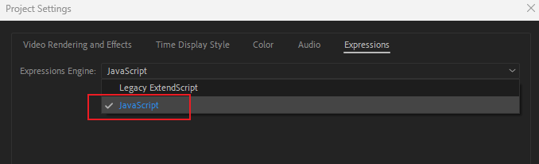

# Expression Troubleshooting

## Introduction

This guide covers common After Effects expression errors and quick fixes. Follow these steps to troubleshoot, and find out how to ask for help if needed.

## Most Common Issue


The wrong Expression Engine (ExtendScript) is being used.\
\
**Fix:** \
**1. G**o to File > Project Settings > Expressions\
2\. Change the Expression Engine to **JavaScript** ([available on AE 2019 and later.](https://help.pixflow.net/portal/en/kb/articles/after-effect-change-expression-engin))&#x20;


<figure><figcaption></figcaption></figure>

## Other Common Issues

* **Typos or Case Sensitivity Errors:** Double-check that variable or function names are spelled correctly and have the right case (JavaScript is case-sensitive).
* **Single Value Instead of an Array:** If you assign a single value to properties that expect an array (e.g., Scale), you will get an error.

```javascript
myScale = 5; // Incorrect
myScale = [5, 5]; // Correct
myScale = 5; s = [myScale, myScale]; // Another correct option
```

* [ ] **Missing Semicolons:** Make sure to end each line with a semicolon `;`
* [ ] **String vs. Variable Confusion:** Listing a variable as a string when it shouldn’t be. **Example:**\
  `"`myText" is a string, whereas `myText` is a variable.


## **When to ask for help?**

If you tried everything above, and nothing still works. There are two things you can do:

1. You can **download the tutorial project files** that I usually provide for free on my [Gumroad](https://nosleepcreative.gumroad.com/?recommended\_by=more\_like\_this), and copy and paste my code into your projects to get it to work. From there, you can also compare what I have written and your code to see where is the mistake.
2. **If you have to ask me for help,** what I appreciate is having **more context and description** of your problem. For example:

* Which lines does the error occurred?
* What does the error(s) say?
* What have you tried?&#x20;
* Have you consulted this guide and tried the solutions I mentioned?
* What AE version are you running, and what OS.

**Sample format for requesting troubleshooting**

_Hello, I having `problem` with `line number`. The error says `errorMessage` . I have tried `solution` but I still cannot fix the issue._&#x20;

### **What doesn't help**

1. Saying that "I wrote the code exactly" or I followed your tutorial. If it didn’t work, something else is likely wrong—usually a small typo.
2. Provide as much detail as possible so I can help you quickly.

## More readings

* [How to troubleshoot expressions errors](https://www.youtube.com/watch?v=VdaGqq4I0qM\&t=1426s), Intro to Expression Rigs in After Effects, Zack Lovatt
