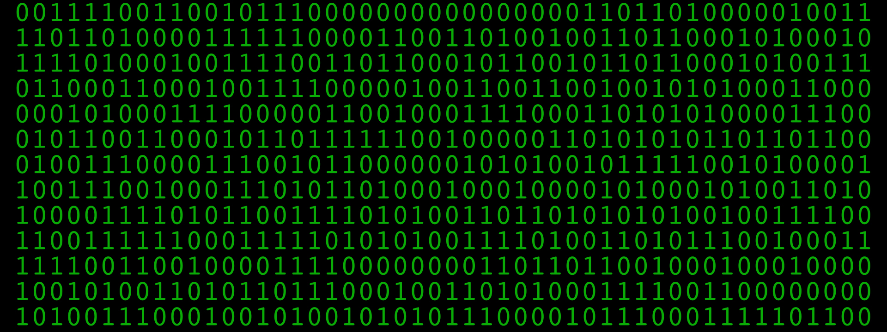

# Type & Text

## Recommended readings

* [ WorkBench 34: Expression Selector Intro](https://www.youtube.com/watch?v=FcSX2Heirko)

## Basics

```javascript
// getting the character count
l = thisComp.layer("your text layer").text.sourceText.length;

// getting word count 
l = thisComp.layer("your text layer").text.sourceText;
wordsCount = l.split(/ ,| | \./).length;


// Matching text with regex
thisComp.layer("text").text.sourceText.toLowerCase().match(/\w+\./))

// includes() — determines whether a string contains the characters of a specified strin
var str = "Hello world, welcome to the universe.";
var n = str.includes("world");
```

## Utility Functions

### Find Number of Layers that includes string

```javascript
function findLayerbyName(str) {
    var n = thisComp.numLayers;
    var numMattes = 0;
    for (i = 1; i <= n; i++) {
        thisComp.layer(i).name.includes(str) == 1 ? numMattes += 1 : 0;
    }
    return numMattes
}

findLayerbyName("matte")
```

## SourceText Repeater



```javascript
n = 10; // number to times to repeat
value.repeat(n)
```



```javascript
var n = 8; // number of times to repeat
s = myText = value
;
for(i=1; i<n; i++) s += myText; 
s;
```



```javascript
n = 8; // connect to a slider 
s = myText = value
;
for(i=1; i<n; i++) s += "\r" + myText; 
s;
```



## Parsing text

### [Sourcetext from Comp Name](https://zacklovatt.com/split-sourcetext-from-comp-name)

```javascript
// if comp name is "comp_05", to get number use this
thisComp.name.split("_")[1] // replace delimiter based on your needs
```

### Separating source text line feeds into an array

```javascript
// Method 1 
txt = thisComp.layer("insert Text").text.sourceText;

txt.split("\r")[3]; // Regex


// Method 2:using name as index
txt = thisComp.layer("insert Text").text.sourceText;
myIndex = thisLayer.name;

txt.split("\r")[myIndex];
```

### [Number from comp name](https://www.w3schools.com/jsref/jsref\_parseint.asp)

```javascript
myNum = parseInt(thisComp.name.split(" ")[1],10);
```

## Numbers

### Rounding numbers



```
// Use any of the following
Math.floor(value);
Math.ceil(value);
```



```javascript
x = time;
pow = Math.pow(10,5) // 5 is the number of decimals 
x = Math.round(x*pow)/pow;
```



```
// apply to sourcetext
x = 2 // number of decimal points
value.toFixed(x);
```



### Round up if above threshold

```javascript
function roundSpecific(num,thres){
    dec = num - Math.floor(num)
    if(dec>=thres) {num = Math.ceil(num);
}
return num
}
// usage 
roundSpecific(385.96,.9)
```

### Counter

```javascript
startTime = 0
endTime = 2;
startNum = 0;
endNun = 10000
linear(time,startTime,endTime,startNum,endNum);
```

### Sequence of number

```javascript
//user variables
var startNum = 0;
var maxNum = 200;
var numCol = 10;
var numZero = 2;
var numSpace = 1;

var s = "";


for (var i = 1; i <= maxNum; i++) {
    // add startNum 
    var n = startNum + i - 1;

    // add zeroes
    for (var j = 1; j <= numZero; j++) {
        if (n < Math.pow(10, j)) s += 0
    }
    // add number to string
    s += n;

    // add spaces 
    for (var j = 0; j < numSpace; j++) s += ' '

    // add line break 
    i % numCol == 0 ? s += '\n' : s

}
```

### Binary&#x20;





```javascript
function binary(maxNum, col, seed) {
    seedRandom(seed, true);
    var s = "";
    for (i = 1; i <= maxNum; i++) {
        s += Math.round(random()) + ' ';
        if (i % col == 0) s += '\n'; // add line break
    }
    return s
}

binary(500, 25, 1)
```



```javascript
n = 300; // connect to slider
seedRandom(seed,true);
let m = b = '';
for(i=0;i<n;i++){
	seedRandom(i+seed,true);
	b = Math.round(random(1)).toString()
	m +=b;
}
```



## Letters

### Random Alphabet

```javascript
function genLetter() {
    r = random(65, 90); //from a to z
    return String.fromCharCode(r);
}

function randAlphabet(maxNum, col, seed) {
    seedRandom(seed, true);
    var s = "";
    for (i = 1; i <= maxNum; i++) {
        s += genLetter() + ' ';
        if (i % col == 0) s += '\n'; // add line break
    }
    return s
}
randAlphabet(500, 25, 1)
```

## Dates

### Current date

```javascript
D = new Date(Date(0));
“” + D.getDate() + “/” + (D.getMonth()+1) + “/” + D.getFullYear()

// get year
D = new Date(Date(0));
D.getFullYear()

// get month 
D = new Date(Date(0));
D.getMonth()+1

// get day
D = new Date(Date(0));
 D.getDate()
```

## Expressions selector

### Default

```javascript
selectorValue * textIndex/textTotal
```

### %

```javascript
if(textIndex%2) 0; else 100
```

### [Random ](https://forums.creativecow.net/docs/forums/post.php?forumid=227\&postid=8595\&univpostid=8595\&pview=t)position from textIndex

```javascript
seedRandom(textIndex,true);
random([100,100]);
```

### Select text indexes explicitly; e.g. 1, 3, 7, 14, 22, etc.?

```javascript
If you don't have a lot of numbers, then this works:

if(textIndex === 1 || textIndex ===3) {
 100;
} else {
 0;
}

If you do have a ton of numbers, then this works:

i = [1,3,5,7,10,11];
inArray(i);

function inArray(obj) {
 b = 0;
 for(i = 0; i < obj.length; i++) {
  if(obj[i] === textIndex) {
   b = 100;
   break;
  }
 }
 return b;
}
```

### Sin wave effector \[[source](https://forums.creativecow.net/thread/227/17667)]

```javascript
freq = .5;
selectorValue*Math.sin(time*freq*Math.PI*2 + Math.PI*2* textIndex/textTotal)
```

## Expression Selector (Regex)

```javascript
https://forums.creativecow.net/thread/227/41461
Oleg Pirogov
https://dribbble.com/zeplin
```

```javascript

var t = text.sourceText;
var regex = /\d[a-z]+(?=,)/g;

function indexMatched(index){
var matched = false;
var match;
var i=[];

while ((match = regex.exec(t)) !== null){
matched |= match.index<index & index<match.index+match[0].length;
i.push([match, match.index, match.index+match[0].length]);
}
return matched;
}

indexMatched(textIndex-1) ? 100 : 0;
```

### [Words inside parentheses ](https://forums.creativecow.net/thread/227/42339)

```javascript
var t = text.sourceText;
var regex = /\(([^)]+)(?=\))/g;

function indexMatched(index){
var matched = false;
var match;

while ((match = regex.exec(t)) !== null){
matched |= match.index<index & index<match.index+match[0].length;
}
return matched;
}

indexMatched(textIndex-1) ? 100 : 0;

```

### Hexcode

```javascript
var t = text.sourceText;
var regex = /[A-Fa-f0-9]{6}/g;

function indexMatched(index){
var matched = false;
var match;

while ((match = regex.exec(t)) !== null){
matched |= match.index<index & index<=match.index+match[0].length;
}
return matched;
}

indexMatched(textIndex) ? 100 : 0;
```
