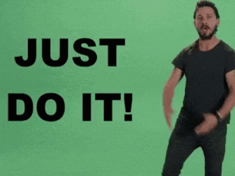

# Getting Started with Expressions

## Introduction

Welcome to my comprehensive guide on JavaScript and After Effects Expressions! This page is designed to be your one-stop resource for learning, enhancing, and mastering the art of JavaScript, particularly in the context of Adobe After Effects.&#x20;

## Reference Library

### **Javascript**

* [Javascript, w3schools](https://www.w3schools.com/js/js\_object\_definition.asp)
* [Javascript ES6, The Coding Train](https://thecodingtrain.com/Tutorials/16-javascript-es6/)
* [ECMAScript 6 updates, lukehoban](https://github.com/lukehoban/es6features)

### Expressions

* **Documentation**
  * [Adobe User Guide - Expression Basics](https://helpx.adobe.com/after-effects/user-guide.html/after-effects/using/expression-basics.ug.html)
  * [Expression guide](https://readthedocs.org/projects/after-effects-expressions-guide/downloads/pdf/latest/) (PDF)
  * [Aenhancers — Expressions](http://expressions.aenhancers.com/)
* **Tutorials**
  * [Animoplex](https://www.youtube.com/channel/UCbfz\_keteqaKbpiRiS95Dqg)
  * [Motionscript ](http://www.motionscript.com/)by Dan Ebbert
    * [Mastering expressions](http://www.motionscript.com/mastering-expressions/table-of-contents.html)
* **Francois Lefebvre**
  * [After Effects Incredible Expressions Challenge](https://www.youtube.com/playlist?list=PLZAr8tT8TcsRj62nIO7ILCMitj5RKjsMf)
  * [The Power of Expression Book](https://aescripts.com/the-power-of-expression/)
* **Resources**
  * [**JR Canesto AE Tricks Google Sheets**](https://docs.google.com/spreadsheets/d/1a3ArTUHAJwVi-ObZofvz6IfrKbSGSENlaTIRTs8pAJU/edit#gid=0)

### **Industry tools**

* [Templater](https://dataclay.com/templater/)
* [CompsFromSpreadsheet](https://aescripts.com/compsfromspreadsheet/)

### Source cited

* [UI (Window, dialog, palette etc) reference info for AI scripting](https://forums.adobe.com/thread/1238745)
* [https://zacklovatt.com/tutorials](https://zacklovatt.com/tutorials)

## NoSleepCreative Expression Starter Pack

* [JSX Cheatsheet](expressions/jsx-cheatsheet.md)
* [Basic Expression Workshop](https://youtu.be/aZ5F1eCm428), NoSleepCreative&#x20;
* [Expression snippet library](expressions/)
* &#x20;["Advanced After Effects: Coding for Motion Design" Domestika Course](https://www.domestika.org/en/courses/3818-advanced-after-effects-coding-for-motion-design)

## FAQs

<figure><figcaption></figcaption></figure>

### How do I get started with coding and expressions?

The key to mastering coding expressions lies in consistent practice within your projects. A fondness for math can be a significant advantage, as coding often resonates with those who enjoy mathematical concepts and organized thinking.&#x20;

To kickstart your journey, here's a structured learning path I recommend:

1. **Start with my** [**Expression workshop video**](https://youtu.be/aZ5F1eCm428)**: T**his will give you a quick introduction to the basics of expressions.
2. **Dive into** [**Animoplex tutorials**](https://www.youtube.com/c/Animoplex/playlists)**:** Progress to learning how to implement expressions into your animations in various ways.
3. **Practice Writing Your Functions:** Challenge yourself by writing your own functions/code solutions, applying the concepts you've learned.
4. **Refine Your Code**: Aim to write cleaner, more efficient code. Practice using advanced array methods like map, reduce, and filter, and familiarize yourself with arrow functions for more concise code.

### Do I need to know Javascript before I get into expressions?

Not necessarily,  while a foundation in JSX helps, you can **easily learn that as you are learning expressions.** I often refer to [w3schools](https://www.w3schools.com/js/) to look the the functions documentation. There are a lot of them but you only need a handful eg. variables, arrays, string, operators, loops, conditional, function, math, or random. If you can understand these concepts, writing expressions can be a breeze.&#x20;

### Do I need to be good at expressions to be a better Motion Designer?

Absolutely NO. You do not have to be good, you just need to know the important ones (eg. Ignore Scale inheritance from Parent). Most of my [master-studies tutorials ](https://www.youtube.com/playlist?list=PL1TQbviAEvf3C\_W2K-PE8mpOys2n9BDch)(with the exception of Ordinary Folk's ones) uses basic expression to do make things look "complex". Here are some examples:

* [**Flatwhite Motion wOo video**](https://www.youtube.com/watch?v=cLr1YDdqVxg\&t=16s)**:** uses single expression of valueAtTime
* [**Flatwhite Motion Aicy Flying Orb**](https://www.youtube.com/watch?v=HswPRuVbeSM\&t=80s)**:** uses a detailed wiggle function&#x20;
* [_**Creativity**_](https://vimeo.com/424805218) by Jose Pena 32-36s: uses "Ignore scale rom parent"

**Your main goal when learning expressions is not mastery but**[ **fluency and comprehension**](https://www.optilingo.com/blog/general/the-difference-between-proficiency-and-fluency/)_**.**_ Just like learning a foreign language, the goal is not spew out fanciful words but rather to understand and communicate with one another. In our context, we want to be able to read expression code or algorithms, understand their functions, and modify them. You may not necessarily write intricate functions yourselves, but you can at least know how to source expressions online and utilize them for your projects, or communicate to a more code-savvy artist what you are trying to develop.

### Are there any paid training courses you recommend?

I do recommend my "[Advanced After Effects: Coding for Motion Design](https://www.domestika.org/en/courses/3818-advanced-after-effects-coding-for-motion-design/thedesmonddu)" course on Domestika. It offers specialized training in coding within After Effects, tailored for those keen on mastering advanced motion design techniques.

An alternative course to consider is the School of Motion's Expression course, although I haven't personally taken it. Notably, my improvement in expressions largely came from a scripting course from FXPHD.

### Best way to learn expressions

#### Play

Personally, I really enjoyed Mathematics, it was my strongest and favorite subject in school. I love solving riddle and discovering patterns and that is how I see expressions: They are just are fun riddles. Usually I would get an idea about an expression to animate or design something, and **I would spend lots of time and effort figuring it out even if I was not going to use for any current projects.** Sometimes, I am unable to sleep because i'm thinking of coding ideas. Hence, fun is an element when it comes to learning!

#### Make your expression library

There are just way too many expressions to write or remember, that is why I have this wiki site to house everything. I recommend anyone who want to get good at expression to start their own wiki page and curate your own code snippets you found or wrote yourself. You can use Gitbook like me or Google Sheets like JR Canesto/Ordinary Folk.

<figure><figcaption></figcaption></figure>

#### **Just do it**

When I first started, I would type out expressions from tutorial and avoid copying and pasting. Even if I do not understand what I am typing, I am building the coding ability into my subconscious.&#x20;

<figure><figcaption></figcaption></figure>

## Tips

### Complex expressions ≠ amazing animation

I sensed that people think that writing long lines of complex expression code will yield amazing animation and design. In truth, that is not the case. The adage "Less is More" still applies when it comes to programming and coding. What we should aim for instead when writing expressions  (or anything actually) is **Profound Simplicity (James Clear) or Informed Simplicity (architect Matthew Frederick) .**&#x20;

**Basically, Everything should be made as simple as possible, but no simpler (Albert Einstein).** &#x20;

### **Focus on problem solving, not improving at writing expressions**


