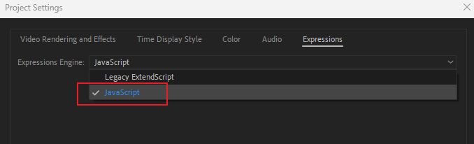

# Modeling

## Nodes you should be familiar with&#x20;

* Carve
* Resample
* Polyframe
* Sweep
* Skin
* Polyfill
* Polybevel

## HUD

* Grid
  * `box` > `pointsfromvolume`&#x20;
  * `VOP`&#x20;
  * `point` add alpha&#x20;
  * Symbol making
    * Circle > resample > delete > xform
* Outer rings
  * Circle (open arc) > copy&#x20;
  * Transform > resample > polyframe > copy&#x20;
  * Grid > polybevel > merge > cirle
  * Circle > sweep > carve&#x20;
* Part 3&#x20;
  * Pattern  0 N
* Part 4 connecting lines
  * tube&#x20;
  * popnet
  * popwrangle&#x20;
    * i@origin = i@id
  * popreplicate&#x20;
  * popattract
  * popvop > tnoise to vel
  * popcollsiondetect
  * pop

I would create "sprites" seperately and add object merge

* Rectangle > bevel&#x20;
*

