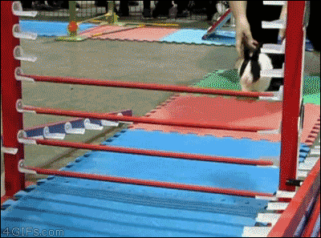

# How to Senior

## **On becoming senior students**

**This is the stage where you design where you go in life, how your design and art informs or engages the human experience.** This is a fairly difficult challenge, you are like Icarus (or Daedalus actually) trying to take flight with your own inventiveness. This inventiveness does not need to come in the form of a screen design narrative. In the words of John Colette, professor of Motion Media Design at SCAD Savannah:

> ## &#x20;Ambition will always outstrip capacity&#x20;

You might be paralyzed by what you set out to do. You might feel defeated. You definitely will procrastinate! However, this is natural, and part of the process.

We can alleviate the process by beginning to **measure your own form of success**, and plot your own map of getting there. This is the stage where interest lies not in answers but in questions and mysteries. If you graduate doing what you have planned, than you have failed. If all college did was prepare you for a job, then your teachers and schools have failed you. You are better off watching tutorials at home, making a showreel, and apply for jobs in that case. The process of the your senior project is much more psychological rather than practical (getting a job); it is about achieving the individuation of your creative soul and adulthood.

> ## &#x20;Ask yourself. How does your art and design better the human experience? What are you trying to fulfill? Tell a story? Change culture? Change the world?  Or do you just want a job/visa?

## **Measurements of Success**

> Success is the progressive realization of a worthy ideal. - from _The Strangest Secret_

What is success to you? Success comes in many forms, and varies from people to people. What works for you will not work for some, vice versa. Below are some parameters to help you formulate your form of success.

### Your Personal Hero's journey

* **Completion** (Satisfying the brief/beauty parade)\

* **Telling a story**
  * Rasita Kartarahardja - [_Boxed_](https://vimeo.com/339141525)
  * Patrick Knip, [_I Don't Know_](https://vimeo.com/338468884)
  * Marcelo Meneses,[ Optimistic Nihilism](https://www.marcelomeneses.com/project/optimistic-nihilism)\

*   **Methodology** (Designing how you think / how you live the rest of life / trying something you never done before)

    * Ally Munro - [The Unbearable Lightness of Being](https://www.allymunro.com/project/thelightnessofbeing)
    * Claire Ebby - [Aurelius VR](https://www.claireeby.com/#/aurelius/)
    * Desmond Du - [Pepper Ghost Box](http://duitbetter.com/akasha/)
    * Billy Woods- tree projection
    * Michelle Parry - A live-action short film

    These are my peers' senior project; we all did not possess the skills and knowledge at the inception of our senior projects but drove us was the exploration and entertaining a thought and an idea.\

### Communal / Tribal

* **Dialogue / Creating & Recreating discussion about how we engage the world**
  * Mental health
    * Self-doubt
    * Depression
  * Politic
  * Caroline Maynard's kinetic type piece
  * Nature
  * Technology
* **Spiritual**
  * Transformation of consciousness\

* **Relational Aesthetics**
  * _The Unbearable Lightness of Being_

### Pragmatic / practical approach

* **Professional** (Demonstration of high-demand skills at high quality at high speed)
  * Tanner Riddle:  [Ascentus](https://www.tannerriddle.com/accentus) \

* **Starting a business**

## Core skill: MacGyver-ing your way



Have you ever heard about _**Macgyver**_? It was a 1985 TV series about a fictional secret agent character Macgyver who draws on a vast practical knowledge of science, is able to make use of any mundane materials around him to create unorthodox solutions to any problem he faces. The video above sums up the character.

As ridiculous as it looks, **that is what you have to do in life: making the best out of whatever knowledge, skills, time, and resources at your disposal.**

Still confused? It's called **problem-solving.**

## Retrospect

### 20 Jan 2021 How do we make meaningful choices?

I thought many times about my Senior project for my BFA, it was not exactly the best thing to do because it did not increase the chances of employment after graduation. But in this journey, **I learned how to take risks and be comfortable with the unknown and certainty.** I was also the producer for CoMotion 2019 so I could not give it my all. What I wished I done for my Senior was to start my YouTube channel business since I love teaching so much. Then again, everything happens for a reason at the right time and place. The Universe thought that giving me one last flaming hoop to jump through before graduation was necessary for me to mature as a person and artist. I think we , including myself, all want to make the best out of our lives and decisions we make so they can be _meaningful_. But what constitute "meaningful", how do you even measure that? The truth is that they is no objective way to measure the meaning of how we live our life. And even if we do, our perceptions change as we grow older, and things lose their meanings. The important thing for us is trust ourselves that we will get to where we want to be even if you are walking a road that may not seem so certain. Believe in yourself, and just keep swimming!

Reading:[ Star Trek Picard's Second Chance in _Tapestry_ ](https://www.youtube.com/watch?v=mGvUDvZ7KyU), [_The Tatami Galaxy_ - Master Higuchi's Advice](https://youtu.be/fwIDMk2MaII)

